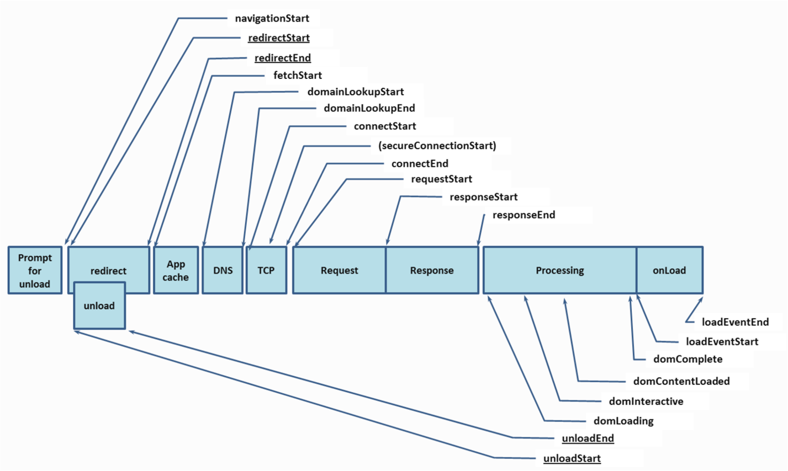
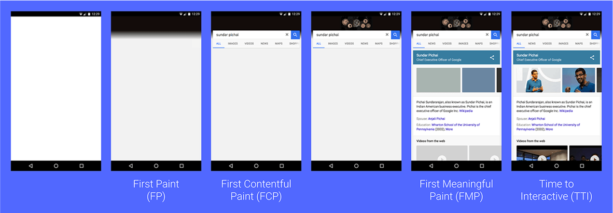
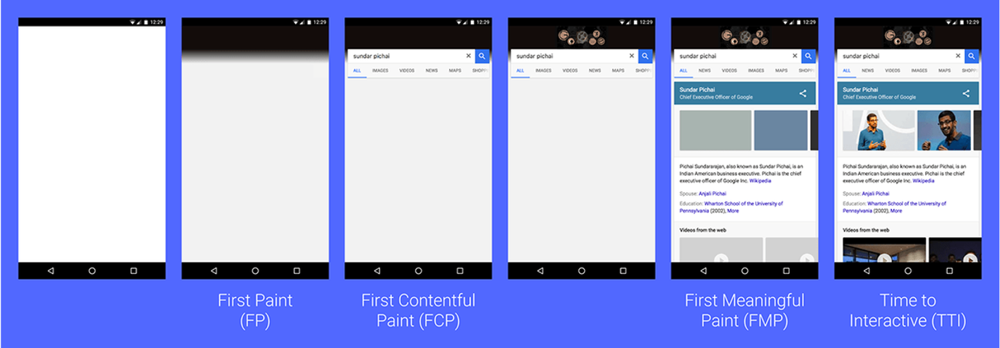
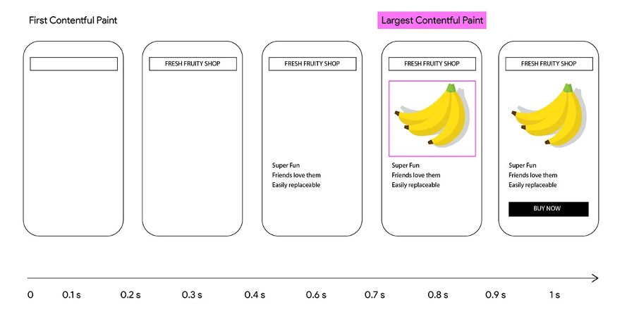
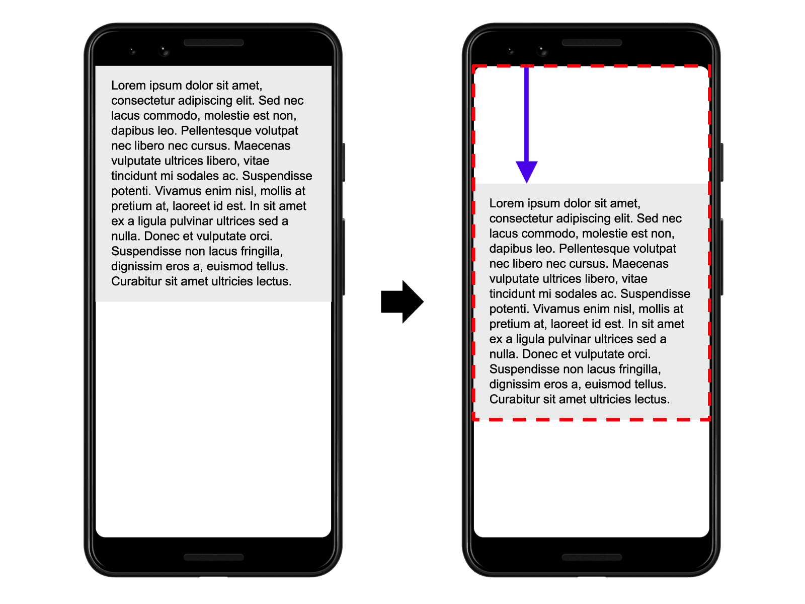
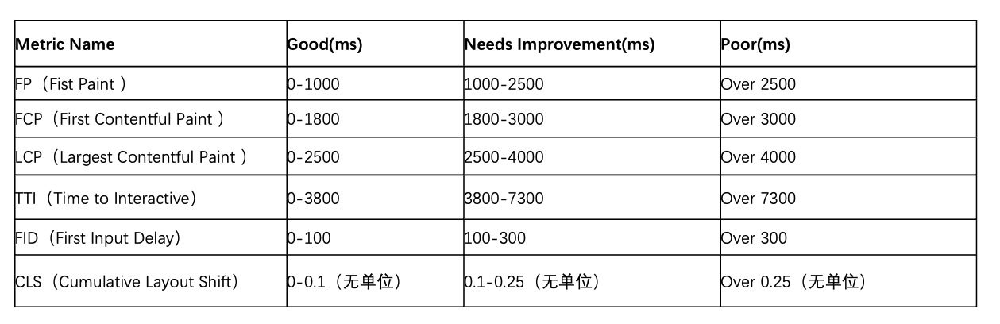

<!--
 * @Author: zch1999 1901394767@qq.com
 * @Date: 2022-07-14 23:48:35
 * @LastEditors: zch1999 1901394767@qq.com
 * @LastEditTime: 2022-07-21 22:13:35
 * @FilePath: /111/监控.md
 * @Description: 这是默认设置,请设置`customMade`, 打开koroFileHeader查看配置 进行设置: https://github.com/OBKoro1/koro1FileHeader/wiki/%E9%85%8D%E7%BD%AE
-->

# 前端监控性能指标

## 常用性能标准

- Navigation Timing：提供了文档导航过程中完整的计时信息，即一个文档从发起请求到加载完毕各阶段的性能耗时。
- Performance Timeline：提供了获取各种类型(navigation、resource、paint 等)的性能时间线的方法。
- Resource Timing：提供文档中资源的计时信息。
- Paint Timing：记录在页面加载期间的一些关键时间点。
- Long Tasks API：检测长任务的存在，长任务会在很长一段时间内独占 UI 线程，并阻止其他关键任务的执行——例如响应用户输入。

## 传统性能指标

**Navigation Timing**
<br/>


**_初始化阶段_**

- navigationStart：用户完成卸载前一个文档的时间点

- redirectStart：页面重定向时的开始时间（如果存在重定向的话）或者是 0

- redirectEnd：如果存在重定向的话，redirectEnd 表示最后一次重定向后服务器端 response 的数据被接收完毕的时间。否则的话就是 0

**_请求阶段_**

- fetchStart：浏览器发起资源请求时，如果有缓存，则返回读取缓存的开始时间

- domainLookupStart：查询 DNS 的开始时间。如果请求没有发起 DNS 请求，如 keep-alive，缓存等，则返回 fetchStart 的时间点

- domainLookupEnd：查询 DNS 的结束时间。如果没有发起 DNS 请求，如 keep-alive，缓存等，则返回 fetchStart 的时间点

- connectStart：当浏览器开始与服务器连接时的时间。如果没有建立连接，如请求是 keep-alive、缓存等，那么它的值等同于 domainLookupEnd

- secureConnectionStart：如果页面使用 HTTPS，它的值是安全连接握手之前的时刻。如果该属性不可用，则返回 undefined。如果该属性可用，但没有使用 HTTPS，则返回 0

- connectEnd：当浏览器端完成与服务器端建立连接的时刻。如果没有建立连接，如请求是 keep-alive、缓存等，那么它的值等同于 domainLookupEnd

- responseStart：指客户端收到从服务器端（或缓存、本地资源）响应回的第一个字节的数据的时刻

- responseEnd：指客户端收到从服务器端（或缓存、本地资源）响应回的最后一个字节的数据的时刻

**_解析渲染阶段_**

- domLoading： 浏览器即将开始解析第一批收到的 HTML 文档字节

- domInteractive: 浏览器完成对所有 HTML 的解析并且 DOM 构建完成的时间点， 是 DOM 准备就绪的时间点

- domContentLoaded: DOM 准备就绪并且没有样式表阻止 JavaScript 执行的时间点，可以开始构建渲染树，一般表示 DOM 和 CSSOM 均准备就绪的时间点

- domComplete: 顾名思义，所有处理完成，并且网页上的所有资源（图像等）都已下载完毕，也就是说，加载转环已停止旋转, 表示网页及其所有子资源都准备就绪的时间点

- loadEventStart: 作为每个网页加载的最后一步，浏览器会触发 onload 事件，以便触发额外的应用逻辑

- loadEventEnd: onload 事件 执行完成

## 用户视角性能指标

### FP & FCP

**FP**

首次渲染的时间点，从用户开始访问 Web 页面的时间点到 FP 的时间点这段时间可以被视为 白屏时间

**FCP**
首次有内容渲染的时间点



**计算**
_performance.getEntriesByType('paint')_

### FMP(First Meaningful Paint) & TTI(First Input Delay)

**FMP(First Meaningful Paint)**
首次绘制有意义内容的时间点
当整体页面的布局和文字内容全部渲染完成后，可认为是完成了首次有意义内容的绘制。
https://web.dev/first-meaningful-paint/


**TTI(First Input Delay)**

测量页面从开始加载到主要子资源完成渲染，并能够快速、可靠地响应用户输入所需的时间

https://web.dev/tti/
https://web.dev/tbt/

## FID(First Input Delay)

测量从用户第一次与页面交互（比如当他们单击链接、点按按钮等等）直到浏览器对交互作出响应，实际能够开始处理事件 处理程序所经过的时间。

_计算_

```new PerformanceObserver((entryList) => {
for (const entry of entryList.getEntries()) {
const delay = entry.processingStart - entry.startTime;
console.log('FID candidate:', delay, entry);
}
}).observe({type: 'first-input', buffered: true});
```

### LCP（Largest Contentful Paint)

最大的内容在可视区域内变得可见的时间点



_计算_

```
new PerformanceObserver((entryList) => {
    for (const entry of entryList.getEntries()) {
        console.log('LCP candidate:', entry.startTime, entry);
    }})
.observe({type: 'largest-contentful-paint', buffered: true});
```

## CLS（Cumulative Layout Shift）:

量化了在页面加载期间，视口中元素的移动程度



_计算_
布局偏移分数 = 影响分数 \* 距离分数

https://web.dev/cls/

## 关键指标基准线


