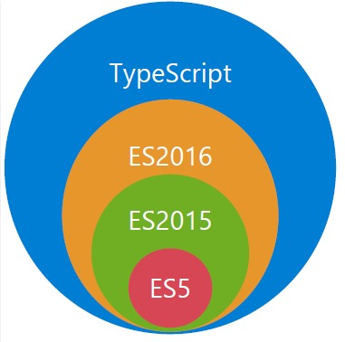

# Typescript基础知识一览
## Typescript是什么
TypeScript 是一种由微软开发的自由和开源的编程语言。TypeScript是JavaScript类型的超集，它可以编译成纯JavaScript。

TypeScript 与 ES5、ES2015 和 ES2016 之间的关系：


## TypeScript 与 JavaScript 的区别

| Typescript                                     | Javascript                               |
| ---------------------------------------------- | ---------------------------------------- |
| 可以在编译期间发现并纠正错误                   | 作为一种解释型语言，只能在运行时发现错误 |
| 强类型，支持静态和动态类型                     | 弱类型，没有静态类型选项                 |
| 最终被编译成 JavaScript 代码，使浏览器可以理解 | 可以直接在浏览器中使用                   |
| 支持模块、泛型和接口                           | 不支持模块，泛型或接口                   |
|                                                |                                          |


## Typescript类型介绍

- Number 类型 支持二 八 十 十六进制数
```ts
    let a: number = 1
```
- String 类型
- Boolean 类型
- Array 类型
```ts
let arr1: number[] = [1,2,3]
// let arr2: Array<string> = [1,2,3]
```
- Tuple 类型
```ts
let tup1: [string, number] = ['1',1]
```
- Enum 类型
- Any 类型
- Unknown 类型 
- Void 类型 表示没有任何类型，一般函数没有返回值时可以使用它
- Null 类型
- Undefined 类型
- Never 类型 （never类型表示的是那些永不存在的值的类型。 例如， never类型是那些总是会抛出异常或根本就不会有返回值的函数表达式或箭头函数表达式的返回值类型； 变量也可能是 never类型，当它们被永不为真的类型保护所约束时。）
- Object 类型 非原始类型

# 类型注解和类型推导

## 类型注释

```typescript
let count:number;
count=123;
```

上面的这段代码就是类型注解，告诉代码 count变量就是一个数字类型。

## 类型推导

如果ts能够自动分析变量类型，我们就什么也不需要做了。 ？？

如果ts无法分析变量类型的话，我们就需要使用类型注解

```typescript
const one=1;
const two=2;
const three=one+two;
```

上面的代码不用写类型注解，ts可以推断出来


function getTotal(one,two){

```typescript
 return one+two;
}
const total = getTotal(1,2)
```

## 断言

### 类型断言
TypeScript 允许你覆盖它的推断，并且能以你任何你想要的方式分析它，这种机制被称为「类型断言」。当使用者了解传入参数更具体的类型时，类型断言能按预期工作
使用方式：
```ts
let someValue: any = "this is a string";
let strLength: number = (<string>someValue).length;
```
```ts
let someValue: any = "this is a string";
let strLength: number = (someValue as string).length;
```
### 非空断言
在上下文中当类型检查器无法断定类型时，一个新的后缀表达式操作符 ! 可以用于断言操作对象是非 null 和非 undefined 类型。具体而言，x! 将从 x 值域中排除 null 和 undefined 。
```ts
fucntiong fn1(val: string | undefined | null) {
    const tmepVal:string = val
}
```

### 确定赋值断言
在变量名和类型注释之间加`!`,表示该变量一定会被赋值。
```ts
// let x: number;
// init();
// console.log(2 * x); // Error

// function init() {
//   x = 10;
// }
let x!: number;
init();
console.log(2 * x);

function init() {
  x = 10;
}
```

# 相关学习网站

1. Typescript官网 https://www.typescriptlang.org/zh/
2. Typescript中文网 https://www.tslang.cn/
3. Typescript中文手册 https://typescript.bootcss.com/
4. 深入理解Typescript([《TypeScript Deep Dive》](https://github.com/basarat/typescript-book/) 的中文翻译版) https://jkchao.github.io/typescript-book-chinese/
5. TypeScript 入门教程 https://github.com/xcatliu/typescript-tutorial
6. 合集：https://github.com/semlinker/awesome-typescript

